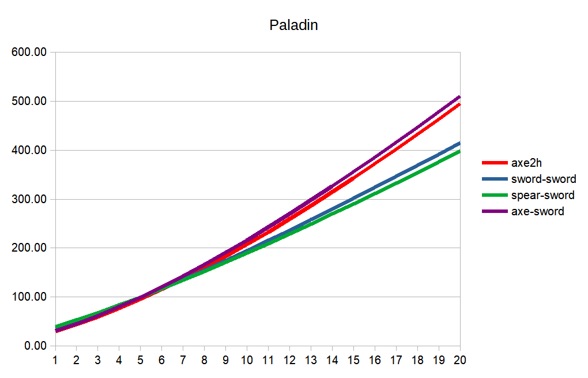
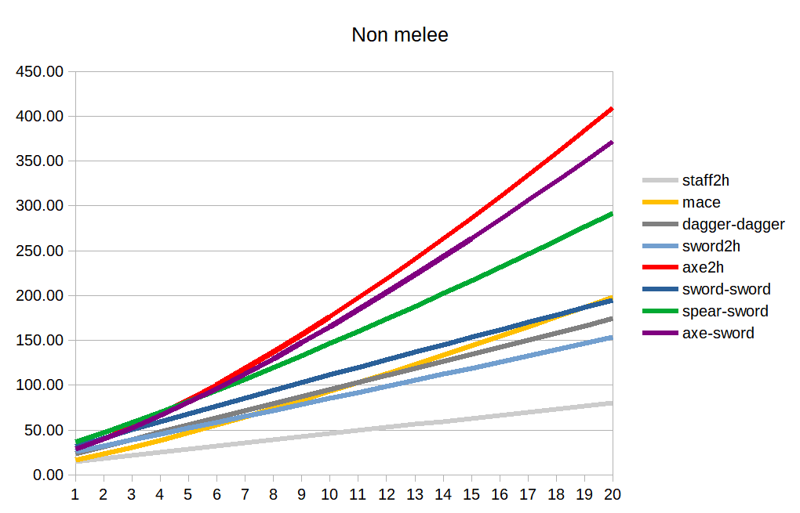

# Might & Magic 6: skill emphasis mod

# Goal

RPG character advancement should be mainly based on their skill progression with some small non skill based effects here and there from equipment, barrels, quests, etc. Putting it simply high skill should be a primary source of every property character has. That what R in RPG is. You build a role by pumping skill points into certain area. Like if you are focusing on axe skill only then you expect this character to be an outstanding axeman but appalling swordsman. This is **NOT** like that in M&M engine. Mastering the skill is undoubtedly more difficult endeavor than acquiring an expensive item. Yet those expensive items give about same bonus in attack and damage as mastering the skill. I would love to turn this around and give skills their well deserved attention. Usually one could raise their selected skills somewhere to level 10 on average by the end of the game. Since there are so few of them we should make player to cherish each skill point and use every possibility to invest more in primary weapon skills.

# Recovery

## Recovery caps

Melee recovery cap is reduced to 10. This still seem to be reasonable cap for end game. Yet it is almost never reachable anyway.

I didn't change ranged recovery cap but it seems that is does not exist!

## Computation mechanics

Intuitive player assumption is that bigger stat value is better, the bonus is positive, penalty is negative. MM recovery mechanics uses an inverse scale which makes it a little difficult to grasp at first. This also creates inherent flaw when attack rate growths faster with skill progression and then suddenly stops at easily reachable cap. From then on it is a complete waste to invest into recovery any more. All speed increasing weapons suddenly become ineffective to develop any further.

This mod internally introduces a notion of attack rate which is a reciprocal to recovery time. All recovery time bonuses now increase the attack rate and it is computed same way as any other positive game stats. Meaning adding 100 attack rate bonus on top of initial 100 attack rate value makes player attack twice as fast which corresponds to 50 recovery. With this approach reaching recovery time cap is still possible but much harder. See computation example below.

Keep in mind that even though computation mechanics changed the attack rate value is still converted to recovery for the purpose of UI display and in game text/help and combat computations.

## Computation example

### Vanilla

<pre>
Dagger    =  60 base recovery
500 speed =  30 recovery bonus
haste     =  25 recovery bonus

result		=   5 recovery which is actually capped at 30
</pre>

### This mod

<pre>
Total recovery bonus from above example: 40 (dagger) + 30 (speed) + 25 (haste) = 95
Resulting attack rate:                   100 + 95 = 195
Converting back to recovery:             100 * (100 / 195) = 51, cap is not reached
</pre>

# Weapon base recovery bonuses

Weapons not improving their speed with skill keep their recovery bonuses.

Axe recovery bonus is -20. Sword recovery bonus is 0. Due to very fast recovery bonus per level progression they still catch up and overtake other weapons pretty soon. Axe (the slowest weapon) will be as fast as dagger at level 10 and then will keep getting faster and faster.

# Combat skills

## Weapon skills

### Standard bonuses

All skills provide same bonuses as they do in vanilla. However, these bonuses are available immediately at Normal rank. Rank now controls how fast these bonuses progress with level instead of triggering them. Bonuses increment per level is much higher than in vanilla and varies based on their combat impact.

### Additional bonuses

* Staff adds small amount to all resistances for all party members. Bonus increases with rank and level.
* Leather and Chain armor add to all resistance for wearer. Bonus increases with rank and level.
* Plate wearer has a chance to cover other team member not wearing plate. Bonus increases with rank.
* Shield wearer decreases all kind of physical and magical projectiles damage.

## Bonus increment per level based on rank

|bonus|normal|expert|master|
|----|----:|----:|----:|
|Attack|2|3|4|
|Speed|3|4|5|
|Damage|1|2|3|
|2h weapon Damage|2|2|2|
|Armor Class from weapon|2|3|4|
|Armor Class from shield|2|3|4|
|Armor Class from leather|2|3|4|
|Armor Class from chain|4|6|8|
|Armor Class from plate|6|9|12|
|Resistances from staff|0|1|2|
|Resistances from leather|4|6|8|
|Resistances from chain|2|3|4|

## Armor speed penalties

|armor type|normal|expert|master|
|----|----:|----:|----:|
|leather|10|5|0|
|chain|20|10|0|
|plate|30|15|0|

## Special abilities

### Staff special abilities

Staff has a chance to shrink or feeblemind opponent. One of these effects is randomly chosen when Staff triggers the effect. These abilities are immediately available at normal skill rank.

* Chance to cause an effect = 10% + 2% \* skill level.
* Effect duration = 5 minutes.

### Mace special abilities

Mace has a chance to paralyze opponent. This ability is immediately available at novice rank.

* Chance to cause an effect = 5% + 1% \* skill level.
* Effect duration = 5 minutes.

### Plate special abilities

Knight and Paladin are seen as team champions rushing forward and covering weaker team members. Plate wearer has a chance to cover other team member not wearing a plate by taking a hit for them. Such chance grows with Plate rank.

|bonus|normal|expert|master|
|----|----:|----:|----:|
|Plate wearer chance to cover other team member|10%|20%|30%|

# Dual wielding

Dual wielding rules are quite complicated in MM6. Player need to remember which weapon uses attack, speed, damage bonuses and which does not. Ugh. Moreover, some of the skill bonuses and enchantment effects may not work if you apply them to the weapon in wrong hand. Most of the time you are out of luck as you cannot possibly wield some weapons in off hand. This is certainly a waste of skills and enchantments. Why not make them all count? That makes it much easier to distribute skill points and fairer to both weapon skills.

## Dual wield mechanics modification

All weapon bonuses are counted!!! Player can mix and match them as they see fit and get full benefit of weapon, skill, and enchantment bonuses from **each** weapon regardless of mix type. Weapons do not shadow each other abilities anymore.

# Two-handed weapon specials

## Double own damage

Two handed weapons confer double damage for their listed damage value. This gives party some damage boost at the beginning of the game when combat skills are yet undevelopped.

I didn't change actual item descriptions as spears can be used both with one and two hands. The bonus is calculated correctly in character stats screen. Consider this a two hand holding special bonus.

## Extra damage per skill level

Two handed weapon receives extra 2 damage per skill level regardless or rank. This also adds some boost to two handed weapons those suck otherwise except maybe 2h axe which is about as good as axe-sword combo without this bonus. With this bonus it becomes a best offensive weapon in hands of non specialized melee fighter.

# Class specialty

MM6 classes are kind of indistinguishable in weapon skills. That's why Paladin is superior to Knight in any way as they can develop all the same weapon/armor skill but also have magic on top of that. I believe some class weapon specialization is in order to make them really represent their strengths.

## Additional weapon skill damage/level for classes

|initial class|weapon type affected|initial|1st promotion|2nd promotion|
|----|----|----:|----:|----:|
|Knight|all melee weapons|2|3|4|
|Paladin|all melee weapons|0|1|2|
|Archer|all ranged weapons|2|3|4|

This is similar to MM7 arms-master bonus. Knight become an ultimate arms-master with Paladin following. Archer specializes in ranged damage instead and now becomes quite powerful shooter.

# Weapon usage preference analysis

## Singe wield vs. Dual wield vs. two-handed

Single wield is inferior to any other wielding type as it was in vanilla. It is a waste to not use extra hand. If not for offense than for defense (shield) at least.

Dual wield in this mod combines attack and speed bonuses from both weapon giving dual wielding some boost. Not too big, though. Attack improves badly in long run. Speed progresses well at the beginning but then slows down and get capped. Damage is the only bonus that keeps progressing well beyond levels 20-30. Unfortunately, only weapons that could be held in off hand (sword, dagger) do not confer damage bonus. So dual wielding does better in this mod comparing to vanilla but not enough to confidently outrun two-handed weapon progression.

The inherent problem with wielding two different items in both hands (weapon-weapon or weapon-shield) is that skill points are split between two skills slowing down their progression comparing to a single type two-handed weapon that doesn't share skill point pool with anything else. Therefore, two-handed axe generally progresses about 1.4 time faster than any *different* type dual combo. That is 1.4 more accuracy \* 1.4 more speed \* 1.4 more damage. Two-handed weapon is always preferrable for Archer as a single non specialized melee fighter class that can hold them. Magic classes (Cleric, Druid, Sourcerer) are not capable of wielding any significantly offensive 2h or dual combo.

Specialized melee fighter classes (Paladin, Knight) are special cases as they receive damage bonus for **every** weapon held. As such Knight should definitely prefer axe-sword dual wielding for max offense benefit. He does not need to sacrifice weapon offensive power for additional protection as his plate and abundant HP protect him enough already. Paladin receives half of Knight damage bonus and, therefore, may opt for either dual or two-handed wielding - player's choice.

Sword-sword and dagger-dagger combos are special case as they progress as fast as two-handed weapon due to same weapon type in both hands. However, since they both lack damage bonus, these combos have mediocre offense and do not compete with axe-sword, spear-sword options.

## Class weapon usage suggestions

### Knight

Knight plays almost all combos pretty well until level 10 thanks to their hefty extra damage bonus. That also includes a famous sword-sword combo which is good for lazy players not interested in developing multiple weapon skills for Knight at the beginning of the game. The most offensive axe-sword combo overtakes all others past skill level 10 and continues improving at slightly higher rate from then on.

Knight can opt to mace-sword combo sacrificing 20% damage rate for paralyzing ability.

### Paladin

Paladin can use 2h axe or axe-sword combo with about same combat effectiveness. Player's choice.

Same is true for Paladin about mace paralyzing ability. Get it for 20% loss in damage rate. If you have both Knight and Paladin the latter is more suitable for mace as weaker class.

### Archer

Archer does not possess close combat bonuses yet it is still capable of using all weapons. Two-handed axe is a clear preference for them due to 2h damage bonus. Besides, since they cannot carry shield there is nothing else for them to do. Another possible option is spear-sword that is somewhate weaker on offense but beefs up AC. Everything else is worse.

### Cleric

Mace for paralyzing. Shield for extra protection if you don't care about small recovery penalty.

### Druid

Mace/Dagger-Shield. Mace is probably better in long rung due to paralyzing while dagger is fast at the beginning. Double daggers are about twice as offensive comparing to a single dagger, of course. However, they still are not a match to any other decent combo. Better protect the weakling.

### Sorcerer

Staff. Best option due to its special effects benefiting whole party greatly. It may be wise to give staff to other magic class if there is no sorcerer in the party.

# Shared group skill advancement

Role playing assumes selecting character buid at start and develop it for greater specialization. It seems that both classes and various melee weapon and armor skills were introduced for that purpose. Classes play their role pretty well due to their distinctive difference in weapon/armor/magic combinations. Whereas, weapons and armor skills do not that much. Picking spear vs. mace, for example, does not differentiate character too much: fighter stays fighter and caster stays caster. Same for armors - they provide only quantitative difference but do not turn character into somebody else. These restrictions are more of annoyance when player finds a nice piece of a weapon/armor but cannot try it out because there are no character skillful enough to use it. This is especially highlighted by bow vs. blaster dilemma when finding blasters at the end of the game completely invalidates and wastes bow skill.

Not anymore in this mod. All skills within each weapon type group (melee weapons, ranged weapons, armors) are advanced simultaneously whenever any one in the group is. That allows swapping items within the group without regret of wasting skill points player worked so hard for.

A small correction to wielding two different weapons is needed due to this change. In vanilla different dual weapons progress about 1.4 times slower as they both require skill point investment. Therefore, this mod does similar correction reducing displayed weapon skill levels to simulate natural vanilla progression. This is for *different* dual weapons only. A little bit not visual for player but I hope this will be a minor inconvenience.

# Spells

## Buffs and healing spells

All stat boost spells affect whole party at novice level.

## Damaging spells

All spells always hit. Making just a few spells to hit depending on skill level is too fine grained and hard to visualize mechanics that is absolutely not needed.

Low level spells fixed damage is increased by about 10. That allows them to be immediately useful at the time of purchase. Also gives player incentive to actually hunt for them in the stores. They naturally will be replaced by more powerful spells as player acquire them. More powerful spells are less mana effective, though. That may be an important consideration in this mod where healing is not that cheap.

Higher level spells fixed damage value is mostly reduced to zero. Their per level damage is somewhat increased to keep up with weapon progression.

Restricted and difficult to aim/use spells get extra damage due to inconvenience. That may give an incentive to use them when conditions are right. These are spells like: Destroy Undead (only against undead), Death Blossom (very difficult to aim), etc.

## Modified spell values

|spell|fixed|per level|
|----|----:|----:|
|Protection from ...||3, 4, 5|
|All stat boosts|10|5, 5, 5|
|Stone Skin|20|4|
|Bless|5|1|
|Heroism|5|1|
|Healing Touch|3-7, 6-14, 15-35||
|First Aid|5, 10, 25||
|Cure Wounds||5|
|Power Cure||5|
|Fire Bolt|10|1-4|
|Ring Of Fire|10|1-4|
|Fire Blast|4|1-4|
|Meteor Shower||1-4|
|Inferno||1-5|
|Incinerate||1-20|
|Sparks|5|1-1|
|Lightning Bolt|10|1-8|
|Implosion|10|1-12|
|Starburst||1-8|
|Poison Spray|7|1-2|
|Ice Bolt|10|1-7|
|Acid Burst|10|1-10|
|Ice Blast|10|1-10|
|Deadly Swarm|15|1-3|
|Blades|10|1-5|
|Death Blossom||1-15|
|Mind Blast|15|1-2|
|Psychic Shock|20|1-15|
|Harm|20|1-2|
|Flying Fist|30|1-10|
|Destroy Undead||1-25|
|Prismatic Light||1-8|
|Sun Ray||1-30|
|Shrapmetal|8|1-8|

# Monsters improvement

Increased weapon bonuses makes easy vanilla monster fighting even easier. Monsters are beefed up to compensate for this. Monsters' damage to player is doubled. Monsters' HP is doubled. Monsters' AC is doubled and slightly adjusted to grow more steadily. Monsters' level is slightly adjusted to grow more steadily. Monsters' speed is significantly increased so they can catch up to player and reduce the "run bypass" tactics to the minimum. Also to let not shooting monsters to quicly close up to player for melee engagement.

Increased monster toughness is compensated by doubling received experience as well as increasing learing multipliers.

# Hirelings

I've changed the probability of different professions appearence based on nice analysis [here](https://gamefaqs.gamespot.com/pc/41610-might-and-magic-vi-the-mandate-of-heaven/faqs/24566).

Some useless professions should not appear at all. Some profession cost are adjusted.

| profession | random chance | cost |
|----|----:|----:|
| Smith | 10 | 100 |
| Armorer | 10 | 100 |
| Alchemist | 0 | 100 |
| Scholar | 10 | 500 |
| Guide | 0 | 100 |
| Tracker | 10 | 200 |
| Pathfinder | 10 | 300 |
| Sailor | 10 | 100 |
| Navigator | 10 | 200 |
| Healer | 10 | 500 |
| Expert Healer | 10 | 2000 |
| Master Healer | 10 | 5000 |
| Teacher | 10 | 300 |
| Instructor | 10 | 700 |
| Arms Master | 10 | 1000 |
| Weapons Master | 10 | 1500 |
| Apprentice | 10 | 200 |
| Mystic | 10 | 1000 |
| Spell Master | 10 | 2000 |
| Trader | 10 | 100 |
| Merchant | 10 | 200 |
| Scout | 10 | 300 |
| Counselor | 0 | 200 |
| Barrister | 0 | 300 |
| Tinker | 10 | 200 |
| Locksmith | 10 | 300 |
| Fool | 10 | 100 |
| Chimney Sweep | 10 | 200 |
| Porter | 10 | 100 |
| Quarter Master | 0 | 200 |
| Factor | 10 | 500 |
| Banker | 10 | 1000 |
| Cook | 0 | 300 |
| Chef | 10 | 400 |
| Horseman | 10 | 100 |
| Bard | 10 | 1000 |
| Enchanter | 10 | 1000 |
| Cartographer | 10 | 200 |
| Wind Master | 10 | 2000 |
| Water Master | 10 | 1000 |
| Gate Master | 10 | 2000 |
| Acolyte | 10 | 200 |
| Piper | 10 | 300 |
| Explorer | 10 | 100 |
| Pirate | 10 | 500 |
| Squire | 10 | 2000 |
| Psychic | 10 | 400 |
| Gypsy | 10 | 100 |
| Negotiator | 0 | 500 |
| Duper | 10 | 200 |
| Burglar | 10 | 2000 |
| Peasant | 0 | 1 |
| Serf | 0 | 1 |
| Tailor | 0 | 5 |
| Laborer | 0 | 1 |
| Farmer | 0 | 1 |
| Cooper | 0 | 5 |
| Potter | 0 | 2 |
| Weaver | 0 | 2 |
| Cobbler | 0 | 3 |
| Ditch Digger | 0 | 1 |
| Miller | 0 | 2 |
| Carpenter | 10 | 5 |
| Stone Cutter | 10 | 4 |
| Jester | 0 | 10 |
| Trapper | 0 | 5 |
| Beggar | 0 | 1 |
| Rustler | 0 | 3 |
| Hunter | 0 | 5 |
| Scribe | 0 | 10 |
| Missionary | 0 | 10 |
| Clerk | 0 | 8 |
| Guard | 0 | 10 |
| Follower of Baa | 0 | 1 |
| Noble | 0 | 100 |
| Gambler | 0 | 10 |

# Learning skill bonus multiplier

* Novice triples bonus.
* Expert quadruples bonus.
* Master quintuples bonus.

As a result, learning skill is more valuable now and is worth to upgrading to master level 10-12. Anything above that is a waste of skill points.

# Missiles auto aim in flight

Missiles (arrows and spells) constantly 3D auto aim their initial target while in flight. Both party and monster cannot dodge missiles by moving sideways/up/down as long as there are no obstacles between missile and target. Running or flying past bunch of shooters in real-time mode is not safe anymore. Nor is flying up/down in turn based mode. It is still possible to avoid the missile by hiding behind an obstacle as before.

This invalidate the strategy of running past shooting outdoor monsters to some important location. Now these previously largely ignored outdoor troops actually guard their territory. One need to kill them all to be able to pass safely.

Later addition. Dargon towers shoot homing fireballs now. They are faster than flight speed. Therefore now it is really dangerous to fly without switching them off first.

# Bringing needed hirelings to party

This is a convenience fix. I am tired to reload game hundreds times just to find needed hireling. Time waste. I have implemented a keyboard shortcut that brings available outside walking peasants to the party and set their professions. I've added just two now but can do more if people need more shortcuts.

* Works outside only and brings outside peasants only if they are available.
* Hiring peasant NPC removes them from the map so you may run out of them on a particular map.

| shorcut | hirelings | comment |
|----|----|----|
| Alt+1 | Weapons Master, Squire | physical offense and defense
| Alt+2 | Spell Master, Mystic | magical offense and buffs
| Alt+3 | Enchanter | magical defense
| Alt+4 | Instructor, Teacher | experience
| Alt+5 | Banker, Factor | money collected
| Alt+6 | Merchant, Trader | trading selling/buying
| Alt+7 | Pathfinder, Tracker | travel speed = food reduction in transit
| Alt+8 | WindMaster, WaterMaster | reaching to places

